# 🌾 KrishiSakhi - AI-Driven Farming Assistant

<div align="center">

```
  _  __         _         _       _    _____           _      _       _ 
 | |/ /        (_)       | |     (_)  / ____|         | |    | |     (_)
 | ' /   _ __   _   ___  | |__    _  | (___     __ _  | | __ | |__    _ 
 |  <   | '__| | | / __| | '_ \  | |  \___ \   / _` | | |/ / | '_ \  | |
 | . \  | |    | | \__ \ | | | | | |  ____) | | (_| | |   <  | | | | | |
 |_|\_\ |_|    |_| |___/ |_| |_| |_| |_____/   \__,_| |_|\_\ |_| |_| |_|
                                                                        
                                                                        
                                                        
```


### **🎯 Empowering Farmers with AI and Data-Driven Insights**  
**Assist • Diagnose • Recommend • Connect**

<p>
  
  
  
  
</p>

<p>
  
  
  
  
  
</p>

</div>

---

## 🚀 **Quick Access**

<div align="center">

| 🌐 **Live Demo** | 📖 **Documentation** | 💬 **Community** |
|:---:|:---:|:---:|
| [**Try KrishiSakhi**](https://krishisakhi-5ajrz9rgokwccjj3agksgz.streamlit.app/) | [**User Guide**](./docs/USER_GUIDE.md) | *Join our community* |

</div>

---

## 🎯 **What is KrishiSakhi?**

KrishiSakhi is an **AI-driven, multilingual farming assistant** designed to empower farmers and agricultural professionals with intelligent tools for crop recommendation, disease diagnosis, market insights, and community support.

```mermaid
graph TD
    A[👩‍🌾 Farmers & Users] --> B[📱 KrishiSakhi Platform]
    B --> C{Features}
    C -->|🌾| D[Crop & Soil Recommendations]
    C -->|🦠| E[Disease Diagnosis]
    C -->|💬| F[AgriBot Chat]
    C -->|📈| G[Analytics Dashboard]
    C -->|🛒| H[Khet Market]
    D --> I[📊 Data-Driven Insights]
    E --> J[🤖 AI Models]
    F --> K[🌐 Multilingual Support]
    H --> L[🔄 Buy & Sell]
```

<div align="center">



</div>

### ✨ **Key Features**

<table>
<tr>
<td width="50%">

#### 🌾 **Crop & Soil Recommendations**
- Data-driven crop suggestions based on soil and weather parameters.
- Fertilizer advice tailored to crop and soil needs.
- Market trends and weather forecasts integration.

#### 🦠 **AI Disease Diagnosis**
- Image and text/voice symptom input.
- AI-powered disease prediction with confidence scores.
- Treatment suggestions and severity estimation.

</td>
<td width="50%">

#### 💬 **AgriBot Chat**
- Conversational AI assistant powered by Google Gemini.
- Supports multilingual text and image queries.
- Session-based chat history.

#### 📈 **Analytics Dashboard**
- Visualize user engagement, crop trends, and disease data.
- Upload custom CSV datasets for analysis.

</td>
</tr>
</table>

---

## 🏗️ **System Architecture**

<div align="center">

### 🌟 **Modular & Scalable Design**

```
┌─────────────────────────────────────────────┐
│               👩‍🌾 Users & Farmers            │
└─────────────────────────┬───────────────────┘
                          │
┌─────────────────────────▼───────────────────┐
│             📱 KrishiSakhi Frontend          │
│          (Streamlit Web Application)        │
└─────────────────────────┬───────────────────┘
                          │
┌─────────────────────────▼───────────────────┐
│               ⚡ Backend Services            │
│  ┌───────────────┬───────────────┬─────────┐│
│  │ Crop & Soil   │ Disease AI    │ Market  ││
│  │ Recommendations│ Diagnosis    │ Services││
│  └───────────────┴───────────────┴─────────┘│
└─────────────────────────┬───────────────────┘
                          │
┌─────────────────────────▼───────────────────┐
│               📊 Data & Analytics            │
│          (CSV, Logs, User Data)              │
└─────────────────────────────────────────────┘
```

</div>

---

## ☁️ **Deployment & Setup**

### 🎯 **Quick Start**

```bash
# Clone the repository
git clone https://github.com/your-username/krishisakhi.git
cd krishisakhi

# Install dependencies
pip install -r requirements.txt

# Run the application
streamlit run streamlit_app.py
```

**🎉 Open http://localhost:8501**

---

## 🛠️ **Technology Stack**

<div align="center">

### 🏗️ **Layers**

</div>

<table>
<tr>
<td width="50%">

#### 🎨 **Frontend**
```text
Streamlit Web UI
Responsive & Multilingual
Real-time Chat Interface
```

#### 🤖 **AI & ML**
```text
Google Gemini (Conversational AI)
Custom Crop & Disease Models
Vosk Speech Recognition
```

</td>
<td width="50%">

#### ⚡ **Backend**
```text
Python & Streamlit
CSV & JSON Data Storage
Role-Based Access Control
```

#### 🔧 **DevOps**
```text
Automated Setup Scripts
Testing & Logging
CI/CD Ready
```

</td>
</tr>
</table>

---

## 📂 **Project Structure**

```
krishisakhi/
├── streamlit_app.py               # Main Streamlit application
├── main.py                       # Core logic and AI integration
├── agents/                       # AI agents and modules
├── archive/                      # Plant disease image datasets
├── dataset_farming/              # Farming datasets and logs
├── utils/                        # Utility functions and helpers
├── requirements.txt              # Python dependencies
├── README.md                     # This file
└── user_input_log.csv            # User input logs
```

---

## 🤝 **Contributing**

<div align="center">

### 🌟 **Join the KrishiSakhi Community**

We welcome contributions to improve and expand KrishiSakhi!

</div>

<table>
<tr>
<td width="50%">

#### 💻 **Code Contributions**
- Bug fixes and optimizations
- New features and AI models
- Documentation improvements
- Testing and quality assurance

#### 🎯 **How to Contribute**
```bash
# Fork the repo
git fork https://github.com/your-username/krishisakhi

# Create a feature branch
git checkout -b feature/awesome-feature

# Make your changes and commit
git commit -m "Add awesome feature"

# Push and open a PR
git push origin feature/awesome-feature
```

</td>
<td width="50%">

#### 🎨 **Content Contributions**
- Crop and disease data
- Farming tips and guides
- Multilingual translations
- Community support and moderation

#### 📋 **Guidelines**
- Original or properly attributed content
- Respectful and accurate information
- High-quality data and media

</td>
</tr>
</table>

---

## 📖 **Documentation & Resources**

<div align="center">

| Resource | Description | Link |
|:---:|:---|:---:|
| 📖 **User Guide** | How to use KrishiSakhi | [**View Guide**](https://docs.google.com/document/d/e/2PACX-1vRHZOSyi_Kdlcyjs_VUGhAfdmY1KBxswyqDDNGTclLejIaBahUrH0oBZBK0nJ5lBPykclZ0Tl66_owQ/pub) |
| 📄 **Project Report** | KrishiSakhi Project Report | [**View Report**](https://docs.google.com/document/d/e/2PACX-1vRDghngWeTuhmhq2a8TeUXLESf9YEb5VLzC-CDp849XOQ0LDKZs9g-rgQD-aCBJNSokTpKf6TL1MlOG/pub) |
| 📄 **User Acquisition Strategy** | KrishiSakhi User Acquisition Strategy Document | [**View Document**](https://docs.google.com/document/d/e/2PACX-1vTo9ZLpC7X_Aj7UvkgDNIfIeyH4EdqMfUEA4nLieVwymX5CzJq2P6G46qOexaw2mTkegp_hB8olYEvh/pub) |
</div>

---

## 💬 **Community & Support**

<div align="center">

### 🌟 **Connect with KrishiSakhi**

<p>
  <a href="https://discord.gg/krishisakhi">
    
  </a>
  <a href="https://twitter.com/krishisakhi">
    
  </a>
  <a href="https://github.com/your-username/krishisakhi">
    
  </a>
</p>


## 📄 **License & Legal**

<div align="center">

### ⚖️ **Open Source Licenses**

| Component | License | Terms |
|:---:|:---|:---|
| 💻 **Source Code** | MIT License | Free to use, modify, distribute |
| 📖 **Documentation** | CC BY-SA 4.0 | Share-alike with attribution |

### 🔒 **Privacy & Security**

 ✅ GDPR Compliant data handling
 ✅ User consent for data collection
 ✅ Regular security audits and updates

</div>

---

<div align="center">

## 🌾 **Made with ❤️ for Farmers & Agriculture**

```
╔══════════════════════════════════════════════════════════════════╗
║                                                                  ║
║ "KrishiSakhi - Your trusted AI companion for sustainable farming"║
║                                                                  ║
║  Empowering farmers with technology, knowledge, and community.   ║
║                                                                  ║
║  🌟 Star us on GitHub | 🤝 Join our community | 📚 Contribute   ║
║                                                                  ║
╚══════════════════════════════════════════════════════════════════╝
```

### 🚀 **Ready to Grow with KrishiSakhi?**

<p>
  <a href="#-quick-start">
    
  </a>
</p>

---

## 👥 Team

<div align="center">

| Role           | Name                |
|----------------|---------------------|
| **Team Lead - Developer** | Surya Saroj Sistla |
| Member         | Chenna Keshav       |
| Member         | Jagadeesh           |
| Member         | Abhishek            |
| Member         | Harika              |

</div>

<p>
  <strong>KrishiSakhi Team</strong><br>
  📧 sistlasree24@gmail.com | 🌐 https://krishisakhi-5ajrz9rgokwccjj3agksgz.streamlit.app/ | 📍 India
</p>

<p>
  <em>Supporting sustainable agriculture through AI and innovation</em>
</p>

</div>
